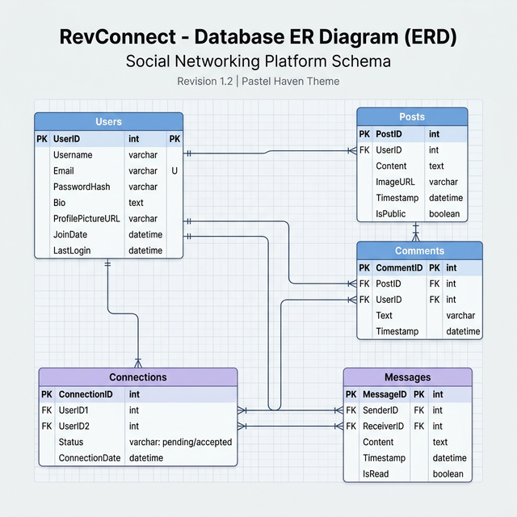
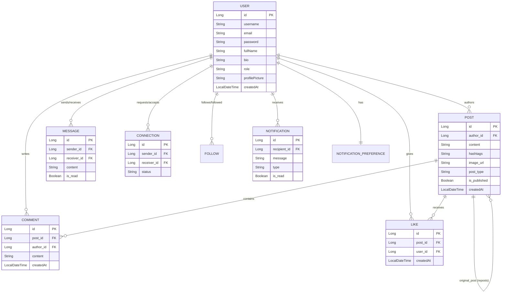

# RevConnect — Professional Networking Reimagined

RevConnect is a high-performance Monolithic Web Application designed for professional networking and community engagement. Inspired by modern social platforms, it features a unique "Pastel Haven" aesthetic combined with robust enterprise-grade security and analytics.

## 🚀 Key Features

- **Advanced Authentication**: Secure login and registration using BCrypt password encryption, supporting both Session-based (Web) and JWT-based (REST API) authentication.
- **Professional Networking**: 
  - **Connections**: Send and receive connection requests to build your professional network.
  - **Following**: Follow users to see their updates in your feed.
- **Rich Content Creation**:
  - Create posts with hashtags and image uploads.
  - Share/Repost existing content.
  - Scheduled posting for automated publishing.
  - Pin important posts to your profile.
- **Dynamic Interactions**:
  - Real-time notification system for likes, comments, connections, and shares.
  - Nested comments and post liking.
- **Private Messaging**: Full-featured inbox with secure one-on-one conversations.
- **Analytics Dashboard**: Comprehensive metrics for user engagement, post reach, and account growth.
- **Search & Discover**: Hashtag-based search and trending posts discovery.

---

## 🛠 Tech Stack

- **Backend**: Java 17+, Spring Boot 3.x, Spring Security, Spring Data JPA
- **Database**: Oracle SQL (Primary), JDBC, Hibernate ORM
- **Frontend**: Thymeleaf, CSS3 (Custom Design System), JavaScript (ES6+), Lucide Icons
- **Logging**: Log4J2 for enterprise monitoring
- **Security**: JWT (JSON Web Tokens), BCrypt, CSRF Protection

---

## 📊 Database Schema (ERD)

Below is the entity-relationship diagram representing the core data model of RevConnect.



### Logical Diagram (Mermaid)


---

## ⚙️ Setup & Installation

### Prerequisites
- JDK 17 or higher
- Oracle Database 19c/21c
- Maven 3.8+

### Database Configuration
Update `src/main/resources/application.properties` with your Oracle DB credentials:
```properties
spring.datasource.url=jdbc:oracle:thin:@localhost:1521/orcl
spring.datasource.username=YOUR_USERNAME
spring.datasource.password=YOUR_PASSWORD
```

### Running the Application
1. Clone the repository.
2. Navigate to the project root.
3. Run the following command:
   ```bash
   mvn spring-boot:run
   ```
4. Access the application at: `http://localhost:8097`

---

## 🧪 Testing
The project includes a comprehensive suite of unit and integration tests. Run tests using:
```bash
mvn test
```

## 📜 License
This project is developed as part of the P2 RevConnect initiative.
